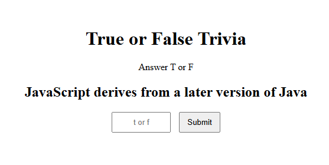
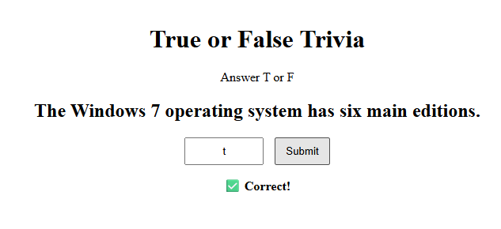

# 🧮 Project Title
### 👤 Author
- Ethan McEvoy (https://github.com/EMcE01)

---

## 📚 Table of Contents
- [📖 Project Overview](#-project-overview--summary)
- [🧰 Tech Stack](#-tech-stack)
- [🛠 Development Tools](#-development-tools)
- [💡 Core Concepts](#-core-concept--new-concepts)
- [✨ Features](#-features)
- [🖼 Visual Aids](#-visual-aids-screenshots--gifs--reports--data-input--output)
- [🧠 Reflection](#-reflection-what-i-learned)

---

## 📖 Project Overview / Summary
> 🔝 [Back to TOC](#-table-of-contents)

Pulls from an public API to show proof of understanding. I chose to pull from a trivia database. The API link specifies what kind of questions and how many per pull. The program then asks the user to answer "t" for true or "f" for false. Making it a simple boolean expression made it easier than have 4 options. It will then tell them if they are right or wrong before moving to the next question.

---

## 🧰 Tech Stack
> 🔝 [Back to TOC](#-table-of-contents)

| Category       | Technology Used |
|----------------|----------------|
| Frontend       | HTML, CSS|
| Backend        | JavaScript|

---

## 🛠 Development Tools
> 🔝 [Back to TOC](#-table-of-contents)

| Tool | Purpose |
|------|--------|
| WebStorm | Primary Code editor |
| VS Code | Code editor |
| GitHub | Version control |
| GitHub | access API |
| Chrome DevTools | Debugging |

---

## 💡 Core Concept / New Concepts
> 🔝 [Back to TOC](#-table-of-contents)

Highlight key concepts learned or applied:

- 📌 Node.js 
- 📌 express
- 📌 APIs
  
---

## ✨ Features
> 🔝 [Back to TOC](#-table-of-contents)

- ✅ Trivia - asks users true or false questions

---
## 🖼 Visual Aids: Screenshots / GIFs / Reports / Data Input & Output
> 🔝 [Back to TOC](#-table-of-contents)

---

## 🧠 Reflection: 
> 🔝 [Back to TOC](#-table-of-contents)

This was an interesting project to build. I feel like it would pair nicely with my flashcard project with "load default data" and would allow me to have options for users to quiz themselves on alternative data they don't have to submit themselves.
---

